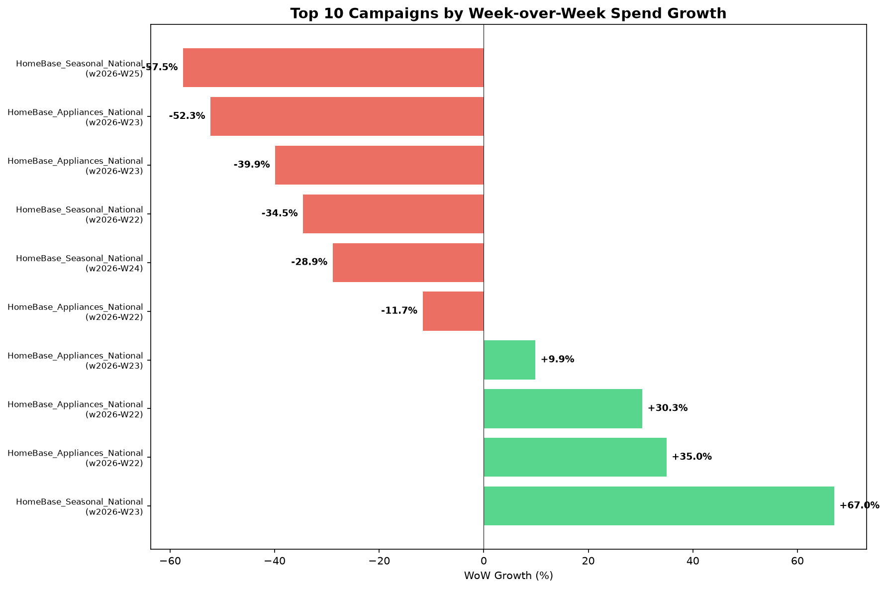
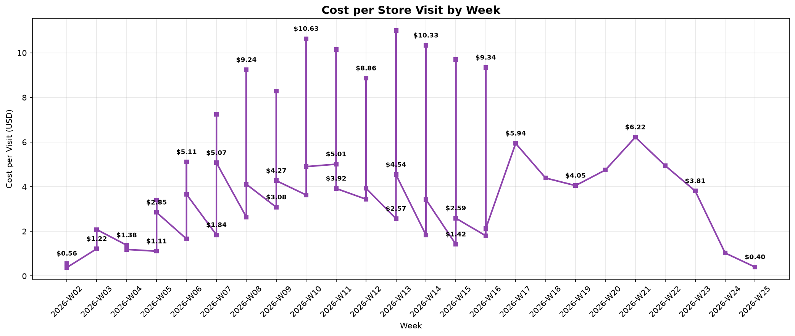

# Project Dentsu: Media Analytics Pipeline

## License
MIT

## Author
Raquel Marques

## Quick Links
- [Architecture](#architecture)
- [Data Model](#data-model)
- [Data Quality](#data-quality-issues-handled)
- [Analysis Results](#analysis-results)
- [Testing](#testing)


## Prerequisites
- Python 3.8+
- SQLite3 (included with Python)
- No external dependencies required
    - pandas and matplotlib are for analysis at the end

## Setup
1. Place raw data files in `data/raw/`:
   - meta_ads_daily.csv
   - google_ads_daily.json
   - store_visits.csv
   - campaign_metadata.csv
2. Run `python run_pipeline.py`
3. Database will be created at `data/pipeline.db`


## Project Structure

```
media-analytics-pipeline/
├── README.md
├── config.py
├── run_pipeline.py
├── requirements.txt
│
├── src/
│   ├── extract.py         # Raw file readers
│   ├── transform.py       # Type conversion, flags
│   └── load.py            # SQLite loading, incremental
│
├── sql/
│   ├── 01_reference_tables.sql
│   ├── 02_silver_meta_ads.sql
│   ├── 03_silver_google_ads.sql
│   ├── 04_silver_unified.sql
│   ├── 05_silver_store_visits.sql
│   ├── 06_gold_dimensions.sql
│   ├── 07_gold_facts.sql
│   ├── 08_log_campaign_name_changes.sql
│   ├── 09_analysis_queries.sql
│   ├── validate_silver.sql
│   └── validate_gold.sql
│
├── data/
│   ├── raw/               # Source files (not committed)
│   ├── staged/            # Intermediate (not committed)
│   └── pipeline.db        # SQLite database
│
├── testing/               # Test scripts (not commited)
│
├── reports/    
│   ├── executive_dashboard.md
│   ├── budget_optimization.md 
│   └── data_quality_notes.md      
│
├── business_queries/
│   ├── 01-Blended_CPA.sql
│   ├── 01-chart.py
│   ├── 02-Spend_Growth.sql
│   ├── 02-chart.py
│   ├── 03-Spend_vs_Store_Visits.sql
│   ├── 03-chart.py
│   ├── 04-Campaign_Exceeding_Budget.sql
│   ├── 04-chart.py
│   ├── 05-ROI.sql
│   └── 05-chart.py
│
└── outputs/               # Generated reports, charts
```


## Architecture

### Layer Philosophy

🥉BRONZE → 🥈SILVER → 🥇GOLD

| Layer | Purpose | Tables |
| --- | --- | --- |
| Bronze | Raw data + flags + audit columns | raw_* |
| Silver | Cleaned, converted, unified | stg_*, ref_*, log_* |
| Gold | Business-ready dimensions and facts | dim_*, fact_* |


#### Database Structure

##### Tables Overview

| Layer | Table | Rows | Grain |
|-------|-------|------|-------|
| Bronze | `raw_meta_ads` | 3,603 | One row per ad per day per objective per placement |
| Bronze | `raw_google_ads` | 1,028 | One row per campaign per day per channel |
| Bronze | `raw_store_visits` | 2,300 | One row per DMA per day |
| Bronze | `raw_campaign_metadata` | 24 | One row per campaign |
| Silver | `ref_calendar` | 366 | One row per date |
| Silver | `ref_exchange_rates` | 18 | One row per currency per month |
| Silver | `ref_dma_region_map` | 15 | One row per DMA |
| Silver | `ref_campaign_list` | 24 | One row per campaign |
| Silver | `stg_meta_ads` | 3,603 | Same as raw |
| Silver | `stg_google_ads` | 1,028 | Same as raw |
| Silver | `stg_daily_performance` | 4,631 | One row per campaign per day per platform per ad |
| Silver | `stg_store_visits` | 2,700 | One row per DMA per day (zero-filled) |
| Gold | `dim_campaign` | 24 | One row per campaign |
| Gold | `dim_dma` | 15 | One row per DMA |
| Gold | `dim_date` | 366 | One row per date |
| Gold | `fact_daily_performance` | 4,631 | One row per campaign per day per platform per ad |
| Gold | `fact_store_visits` | 2,700 | One row per DMA per day |


##### Column Reference

**dim_campaign**
| Column | Type | Description |
|--------|------|-------------|
| campaign_id | TEXT | Primary key |
| brand | TEXT | Brand name |
| product_line | TEXT | Product category |
| region | TEXT | National, East, or West |
| campaign_name_standardized | TEXT | `brand_product_line_region` |

**fact_daily_performance**
| Column | Type | Description |
|--------|------|-------------|
| date | TEXT | Date of performance |
| campaign_id | TEXT | FK to dim_campaign |
| platform | TEXT | meta or google |
| impressions | INTEGER | Ad impressions |
| clicks | INTEGER | Ad clicks |
| spend_usd | REAL | Spend in USD |
| conversions | REAL | Conversions (fractional for Google) |
| conversion_value_usd | REAL | Conversion value in USD |

**fact_store_visits**
| Column | Type | Description |
|--------|------|-------------|
| date | TEXT | Date of visit |
| dma_code | TEXT | FK to dim_dma |
| mapped_region | TEXT | East or West |
| attributed_visits | INTEGER | Attributed store visits |
| attribution_window_days | INTEGER | 7 or 28 |
| is_zero_filled | INTEGER | 1 if filled, 0 if actual |


<br>

### Pipeline Flow

```text
Raw Files → extract.py → transform.py → load.py → SQLite
                                                    ↓
                                              SQL transforms
                                                    ↓
                                        dim_* + fact_* tables
                                                    ↓
                                           Analysis queries
```

<br> 

### Data Model

#### Star Schema

**Dimensions** (attributes):
- `dim_campaign` (24 rows): campaign_id, brand, product_line, region, campaign_name_standardized
- `dim_dma` (15 rows): dma_code, dma_name
- `dim_date` (366 rows): date, year, month, month_name, day_of_week, is_weekend

**Facts** (metrics):
- `fact_daily_performance` (4,631 rows)
    - Grain: one row per campaign per day per platform per ad
    - Metrics: impressions, clicks, spend_usd, conversions, conversion_value_usd
- `fact_store_visits` (2,700 rows)
    - Grain: one row per DMA per day
    - Metrics: attributed_visits, attribution_window_days


#### Relationships

```text
fact_daily_performance.campaign_id → dim_campaign.campaign_id
fact_daily_performance.date → dim_date.date
fact_store_visits.dma_code → dim_dma.dma_code
fact_store_visits.date → dim_date.date
```

<br> 

### Data Quality Issues Handled
**Meta Ads**
- Currency inconsistencies: 133 records missing currency (assumed USD), 95 CAD, 57 GBP (converted via exchange rate table)
- Campaign name changes: Standardized using metadata attributes. History tracked in `log_campaign_name_changes`
- PST timestamps: Converted to UTC (+8 hours)

**Google Ads**
- Duplicate campaigns: Export bug caused duplicates. Deduplicated by keeping newest timestamp or max impressions. Result: 1,055 → 1,028 records
- Cost in micros: Converted to USD (÷ 1,000,000)
- Fractional conversions: Preserved as REAL type

**Store Visits**
- Missing dates: Zero-filled via cross join of calendar × DMA list. 400 records filled
- DMA mapping: Created `ref_dma_region_map` with manual assignment of 15 DMAs to East/West regions
  - East: New York, Philadelphia, Detroit, Boston, Washington DC, Atlanta, Miami, Tampa, Chicago (9 DMAs)
  - West: Houston, Dallas, Phoenix, Los Angeles, San Francisco, Seattle (6 DMAs)
  - National campaigns match all 15 DMAs
- **Join strategy**: National campaigns → all DMAs; East campaigns → East DMAs; West campaigns → West DMAs

**Campaign Metadata**
- Missing budgets: 9 of 24 campaigns missing budget. Flagged with budget_available = 0
- Budget Estimation Logic (Question 4)
    - Daily average spend rate by product_line + region (from campaigns WITH budgets)
    - Multiplied by campaign duration in days
    - Flagged as 'ESTIMATED' vs 'ACTUAL'
<br>

## Key Decisions & Tradeoffs

| Decision | Choice | Rationale |
| --- | --- | --- |
| Architecture | ELT (Extract → Load → Transform) | Transform in SQL for reviewability |
| Storage | SQLite | Zero dependencies, meets requirements |
| Schema | Star schema | Clear separation of attributes vs metrics |
| Currency conversion | SQL via rate table | Rates change over time; table allows updates |
| Name resolution | Metadata attributes | Source of truth, not platform-specific |
| Deduplication | Python (bronze) | Known export bug, mechanical fix |
| Incremental load | File metadata + primary keys | Skips unchanged files, prevents duplicates |
| DMA mapping | Manual East/West assignment | No region field in store visits data |
| Regional join | National = all DMAs, East/West = matching | Campaigns target specific regions |


## Incremental Load Logic
**File Metadata Check**
- Compares file size and modified time against `_ingestion_log`. Unchanged files are skipped.

**Primary Key Dedup**
- Each table has a primary key at full grain. INSERT OR IGNORE skips duplicates.

**Pipeline Tracking**
- _pipeline_tracking table tracks last processed timestamp per staging table. Enables incremental SQL transforms.


## Production Considerations

What I'd Do Differently with More Time
1. Exchange rate API: Replace simulated rates with live API
1. DMA-region mapping: Create explicit mapping table for geographic joins
1. Orchestration: Use Airflow or Dagster for scheduling
1. Testing: Add unit tests for transform functions
1. Monitoring: Set up alerts for pipeline failures
1. CI/CD: Automated testing and deployment

Production Monitoring Plan
- File arrival checks: Alert if files don't arrive by 6am UTC
- Row count validation: Compare against 7-day average
- Spend mismatch alerts: Flag if Meta vs Google spend diverges >5%
- Data quality checks: Daily validation of currency conversion, dedup counts
- Pipeline tracking: Monitor _pipeline_tracking for stalled processes


---

## Analysis Results

[Executive Dashboard](./reports/executive_dashboard.md)

[Budget optimization](./reports/budget_optimization.md)

### 1. Blended CPA


> Only HomeBase as Brand
> HomeBase blended CPA ranges from $44.39 to $47.20 across Jan–Jun 2026. 
> CPA is stable around $45 with February highest ($47.20) and January lowest ($44.39)

### 2. Spend Growth




> Top growth campaign: HomeBase_Seasonal_National (1033) with +67.03% WoW growth in week 23.

### 3. Cost per Store Visits



> Cost per store visit ranges from $0.38 (West, week 2) to $11.00 (National, week 13)

### 4. Campaign Eceeding Budget


> 15 campaigns over budget (68% of 22 analyzed)
> Highest overage: Campaign 1090 at 1156% of budget ($427K vs $37K)
> 2 campaigns excluded due to no spend data (1156, 1251)
> 7 campaigns within budget (5 of these have estimated budgets)


### 5. ROI by Product Line


> All product lines deliver 2.5x-2.7x ROI
> Seasonal and Furniture tie for highest at 2.72x
> Appliances receives most spend ($2.71M) but has lower ROI (2.61x)


---

## Supporting Documents

| Document | Description |
|----------|-------------|
| [Project Status](./ProjectStatus.md) | Development progress and issue tracking |
| [Data Quality Notes](./reports/data_quality_notes.md) | Data issues and confidence levels |
| [Production Plan](./monitoring/production_plan.md) | Monitoring and alerting strategy |
| [Executive Dashboard](./reports/executive_dashboard.md) | Stakeholder summary |
| [Budget Optimization](./reports/budget_optimization.md) | Actionable investment insights |

---

## Testing

### What Was Tested

During development, the following were manually validated:

| Component | Test | Result |
|-----------|------|--------|
| Extraction | Row counts per source | ✔️ 3,603 + 1,055 + 2,300 + 24 |
| Transformation | Google dedup (timestamp → max impressions) | ✔️ 1,055 → 1,028 |
| Transformation | Currency flagging (missing, CAD, GBP) | ✔️ 133 + 95 + 57 |
| Load | Idempotency (second run = 0 new) | ✔️ All sources "unchanged" |
| Load | File metadata check (size + modified time) | ✔️ Skips unchanged files |
| Silver | Meta currency conversion | ✔️ 0 null, 0 negative spend |
| Silver | Google micros conversion | ✔️ 0 null, correct totals |
| Silver | Unified table | ✔️ 4,631 records |
| Silver | Store visits date fill | ✔️ 400 zero-filled |
| Gold | Dimensions row counts | ✔️ 24 + 15 + 366 |
| Gold | Facts row counts | ✔️ 4,631 + 2,700 |
| Queries | All 4 business questions | ✔️ Returns expected results |

### Validation Built Into Pipeline

The `run_pipeline.py` script includes automatic validation:
- Table row counts for all 13 tables
- Null/negative spend check
- Pipeline tracking verification

### What Would Be Added in Production

- **Unit tests** (pytest): For transform functions, dedup logic, currency conversion
- **Integration tests**: End-to-end pipeline with sample data
- **Data quality tests** (Great Expectations): Automated validation of data contracts
- **CI/CD pipeline**: Automated testing on every commit
- **Regression tests**: Compare results against known-good baselines
