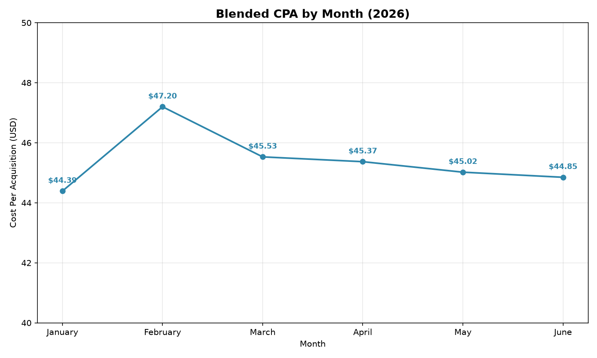
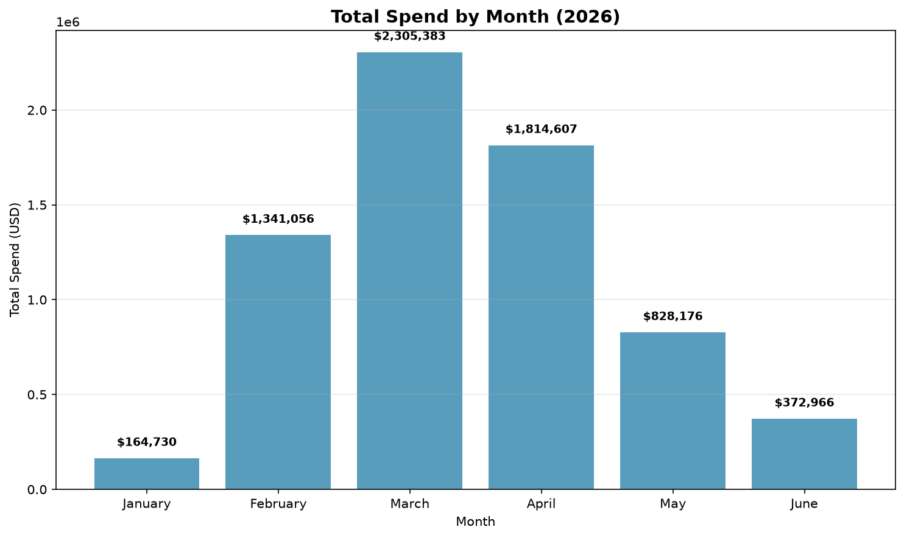
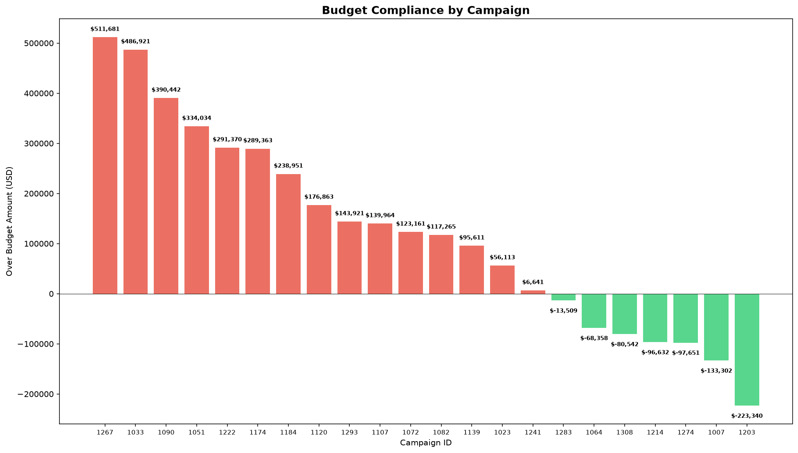
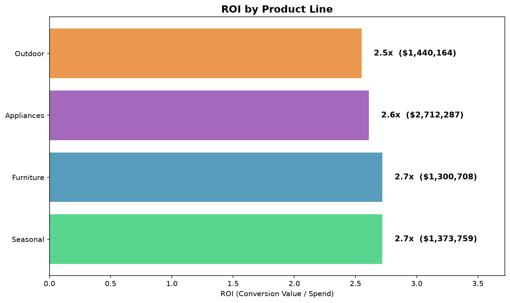

# Executive Summary Dashboard

## Campaign Performance Overview (Jan – Jun 2026)

### Key Metrics at a Glance

| Metric | Value |
|--------|-------|
| **Total Spend** | $6,826,917.86 |
| **Total Conversions** | 149,472.77 |
| **Average CPA** | $45.67 |
| **Active Campaigns** | 22 |
| **Brands** | HomeBase |

### Spend by Platform

| Platform | Spend (USD) | Share |
|----------|-------------|-------|
| Meta | $4,668,579.61 | 68.4% |
| Google | $2,158,338.25 | 31.6% |

**Insight**: Meta receives roughly two-thirds of total media spend.

### Spend by Month

| Month | Spend (USD) | CPA |
|-------|-------------|-----|
| January | $164,729.56 | $44.39 |
| February | $1,341,056.17 | $47.20 |
| March | $2,305,383.25 | $45.53 |
| April | $1,814,606.70 | $45.37 |
| May | $828,175.84 | $45.02 |
| June | $372,966.34 | $44.85 |

**Insight**: March was the highest-spend month ($2.3M). CPA remains stable at ~$45 throughout.

### Top Performing Campaigns (by Conversion Volume)

| Campaign | Spend | Conversions | CPA |
|----------|-------|-------------|-----|
| HomeBase_Seasonal_National (1033) | $558K | 11,863 | $47.08 |
| HomeBase_Appliances_National (1174) | $858K | 17,190 | $49.95 |
| HomeBase_Appliances_National (1090) | $427K | 10,116 | $42.25 |

### Store Visit Performance

| Metric | Value |
|--------|-------|
| Total Attributed Store Visits | 5.7M+ |
| Average Cost per Visit | $3.50 |
| Best Week (Lowest Cost/Visit) | Week 4 ($2.61) |

### Budget Compliance Snapshot

| Status | Count | % |
|--------|-------|---|
| Over Budget | 15 | 68% |
| Within Budget | 7 | 32% |

> **ATTENTION**: 68% of campaigns exceeded their stated budget. This may indicate budgets are set too low or campaigns are performing well and being scaled up intentionally.

## Visualizations

### CPA Trend

### Spend by Month

### Budget Compliance

### ROI by Product Line

> Interesting findings:
> All product lines have similar ROI (2.55x - 2.72x)
> Appliances gets the MOST spend ($2.71M) but has LOWER ROI (2.61x)
> Seasonal and Furniture tie for highest ROI (2.72x) but get less spend

## Key Takeaways

1. **CPA is stable**: $45 average across 6 months shows consistent efficiency
2. **Meta dominates spend**: 68% of budget goes to Meta
3. **Budget overages are widespread**: 68% of campaigns over budget
4. **Store visits are cost-effective**: $3.50 average cost per visit
5. **February-March see highest activity**: likely seasonal peak
6. Product ROI: Consider shifting budget from Appliances to Seasonal/Furniture for better ROI.
